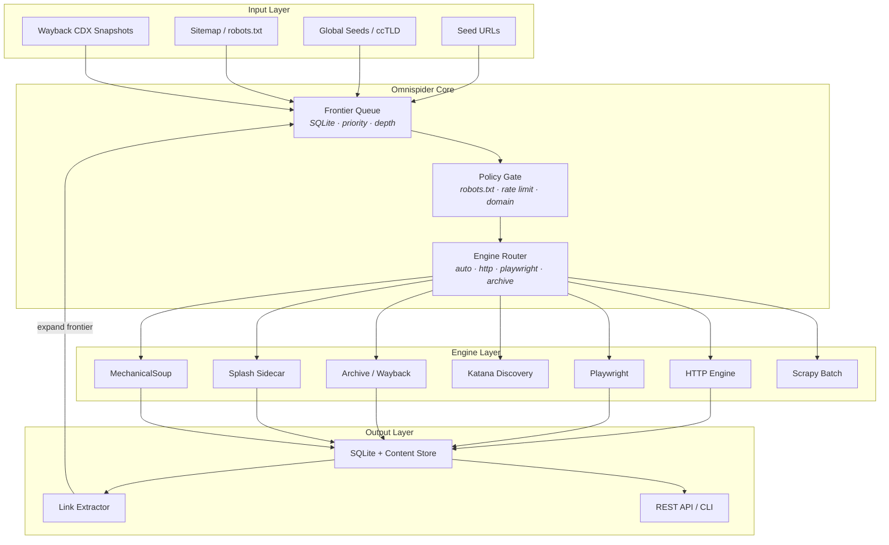
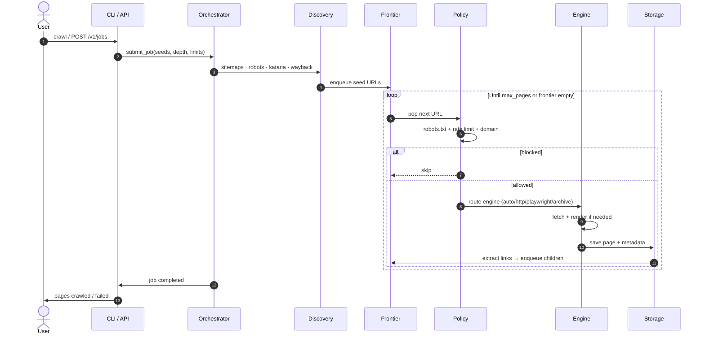
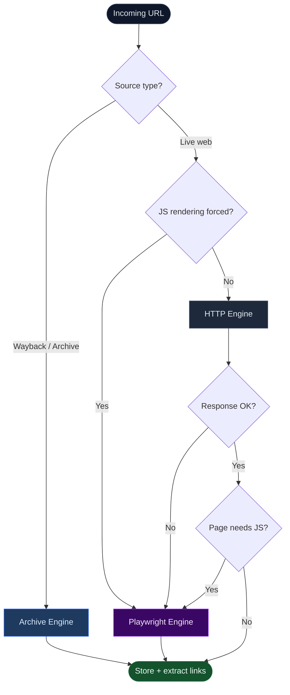
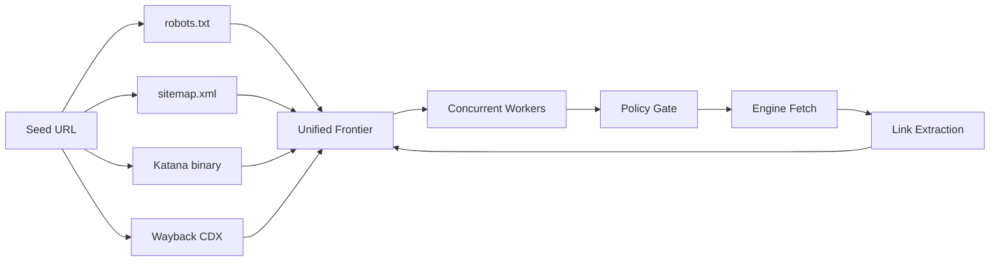

<div align="center">

# Omnispider

### All-in-one web spider orchestrator for the full digital surface

**Live web · JavaScript rendering · Internet Archive · Global discovery · Multi-engine routing**

<br/>

[](https://www.python.org/)
[](https://fastapi.tiangolo.com/)
[](LICENSE)
[](https://github.com/houseofasher/web-crawlers)

<br/>

[Quick Start](#-quick-start) · [Architecture](#-architecture) · [Workflows](#-workflow-logic) · [Engines](#-engine-matrix) · [API](#-rest-api) · [Config](#-configuration)

</div>

---

## Overview

**Omnispider** is a unified crawl orchestrator that routes every request through policy, discovery, and the best engine for the job — static HTTP, browser rendering, archival snapshots, or fast link discovery.

It synthesizes patterns from 12 crawler ecosystems (Scrapy, Playwright, Puppeteer, Crawlee, Colly, Katana, Splash, MechanicalSoup, Portia, Heritrix3, Nutch, StormCrawler) into one pipeline with a CLI, REST API, and persistent frontier.

<table>
<tr>
<td width="33%" align="center">

**Temporal**
<br/><br/>
Wayback Machine CDX
<br/>
Historical snapshots
<br/>
Past → present

</td>
<td width="33%" align="center">

**Spatial**
<br/><br/>
Sitemaps · robots.txt
<br/>
Global seeds · ccTLD
<br/>
Four corners of the web

</td>
<td width="33%" align="center">

**Surface**
<br/><br/>
Static HTML · JS apps
<br/>
Forms · feeds · archives
<br/>
Every page type

</td>
</tr>
</table>

> **Scope note:** Omnispider maximizes *reachable* public coverage ethically — respecting `robots.txt`, rate limits, and domain policy. No crawler can fetch every page ever published; deleted, private, and auth-gated content remains out of scope.

---

## Architecture



---

## Workflow logic

### End-to-end crawl lifecycle



### Engine auto-routing decision tree



### Discovery pipeline



---

## Engine matrix

| Engine | Best for | Vendor inspiration | Install |
|--------|----------|-------------------|---------|
| `http` | Static pages, APIs, feeds | Scrapy · Colly | built-in |
| `playwright` | SPAs, React, Vue, Next.js | Playwright · Puppeteer | `pip install -e ".[browser]"` |
| `archive` | Historical snapshots | Heritrix · Internet Archive | built-in |
| `katana` | Fast link discovery | Katana · Colly | [Install Katana](https://github.com/projectdiscovery/katana) |
| `splash` | JS render sidecar | Splash | run Splash on `:8050` |
| `mechanical` | Forms, sessions | MechanicalSoup | `pip install -e ".[forms]"` |
| `scrapy` | Batch spider projects | Scrapy · Portia | `pip install -e ".[scrapy]"` |
| `auto` | Smart routing (default) | Crawlee patterns | built-in |

Reference vendor trees can be extracted locally — see [`vendors/README.md`](vendors/README.md).

---

## Quick start

### 1 · Install

```bash
git clone https://github.com/houseofasher/web-crawlers.git
cd web-crawlers

python -m venv .venv
source .venv/bin/activate        # macOS / Linux
# .venv\Scripts\activate         # Windows

pip install -e .
```

### 2 · Crawl

```bash
# Live web + sitemaps + Wayback snapshots
omnispider crawl https://example.com --depth 3 --max-pages 500

# Skip archive layer
omnispider crawl https://example.com --no-archive

# Force JavaScript rendering
omnispider crawl https://example.com --js
```

### 3 · Discover & archive

```bash
# Fast URL discovery (sitemaps + Katana when installed)
omnispider discover https://example.com --max 200

# List Wayback Machine snapshots for a URL
omnispider archive https://example.com
```

### 4 · Serve API

```bash
omnispider serve --port 8080
# → http://127.0.0.1:8080/health
```

### Optional power-ups

```bash
pip install -e ".[browser]" && playwright install chromium   # JS rendering
pip install -e ".[forms]"                                       # form crawling
pip install -e ".[scrapy]"                                        # Scrapy adapter
pip install -e ".[dev]" && pytest                               # run tests
```

---

## REST API

```bash
# Start a crawl job
curl -X POST http://127.0.0.1:8080/v1/jobs \
  -H "Content-Type: application/json" \
  -d '{
    "seeds": ["https://example.com"],
    "max_depth": 3,
    "max_pages": 100,
    "include_archive": true,
    "js_rendering": false
  }'

# Poll job status
curl http://127.0.0.1:8080/v1/jobs/{job_id}

# List crawled pages
curl "http://127.0.0.1:8080/v1/jobs/{job_id}/pages?limit=50"
```

| Method | Endpoint | Description |
|--------|----------|-------------|
| `GET` | `/health` | Service health |
| `POST` | `/v1/jobs` | Create crawl job |
| `GET` | `/v1/jobs` | List jobs |
| `GET` | `/v1/jobs/{id}` | Job status |
| `GET` | `/v1/jobs/{id}/pages` | Paginated page results |
| `GET` | `/v1/engines` | Engine catalog |

---

## Configuration

Edit [`config/default.yaml`](config/default.yaml):

```yaml
orchestrator:
  max_concurrency: 16
  max_depth: 5
  max_pages_per_job: 10000

policy:
  respect_robots_txt: true
  rate_limit_per_host: 2.0

archive:
  enabled: true

discovery:
  sitemap: true
  global_seeds:
    - "https://www.wikipedia.org/"

storage:
  database_path: "./data/omnispider.db"
  content_dir: "./data/content"
```

---

## Project layout

```
web-crawlers/
├── omnispider/
│   ├── cli.py              # Typer CLI
│   ├── api.py              # FastAPI server
│   ├── core/
│   │   ├── orchestrator.py # Main crawl loop
│   │   ├── frontier.py     # URL queue (SQLite)
│   │   ├── storage.py      # Jobs + pages persistence
│   │   └── policy.py       # robots.txt + rate limits
│   ├── engines/            # HTTP, Playwright, Archive, Katana…
│   └── discovery/          # Sitemaps, link extraction
├── config/default.yaml
├── tests/
└── vendors/                # Optional local reference trees
```

---

## Data output

| Artifact | Location | Contents |
|----------|----------|----------|
| Job store | `./data/omnispider.db` | Jobs, frontier, page metadata |
| HTML shards | `./data/content/` | SHA-256 sharded page bodies |
| Logs | stdout (structlog) | Structured JSON-ish events |

---

## Repositories

This project is maintained at:

- [github.com/houseofasher/web-crawlers](https://github.com/houseofasher/web-crawlers)
- [github.com/shep95/web-crawlers](https://github.com/shep95/web-crawlers)

---

## License

MIT — see [LICENSE](LICENSE).
